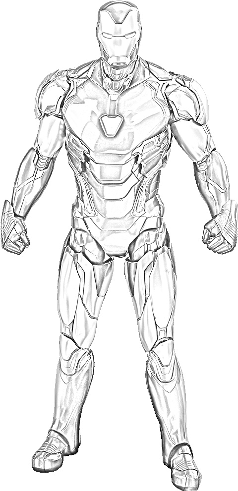

# Python Image convert to Pencil Sketch

Convert your images into **sketches** using **Python OpenCV**.

> We convert an image into sketch file or add sketch filter.

## Using

Put your image and running the app:

```sh
python converter.py
```

### Testing

| Input | Output |
| ----- | ------ |
|  |  |

# Sources

- https://imagetosketch.com/
- https://pencilsketch.imageonline.co/index.php
- https://www.youtube.com/watch?v=MticYzYkofw
- https://www.youtube.com/watch?v=mZNo0U1wIxc
- https://www.askpython.com/python/examples/images-to-pencil-sketch
- https://towardsdatascience.com/generate-pencil-sketch-from-photo-in-python-7c56802d8acb
